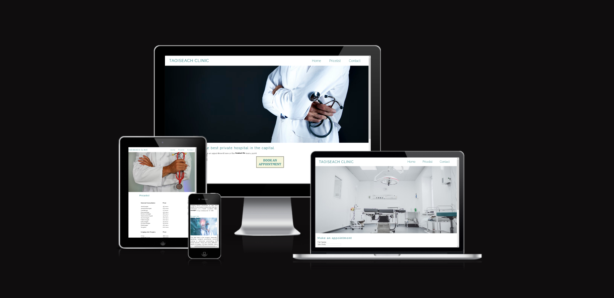
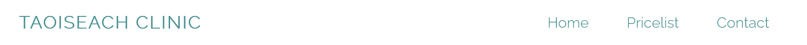
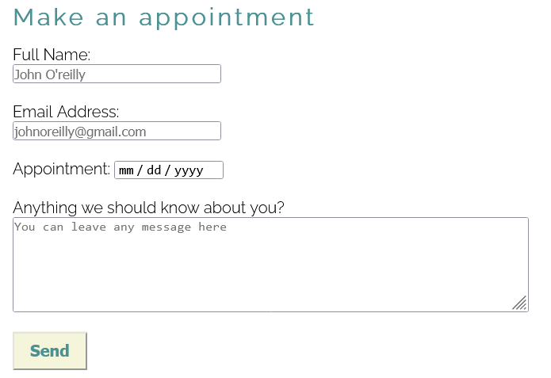
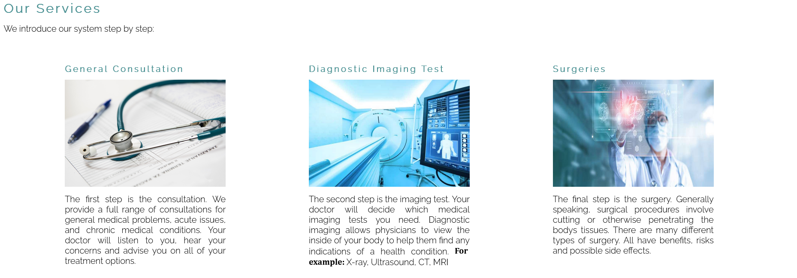
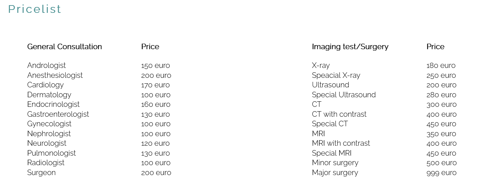
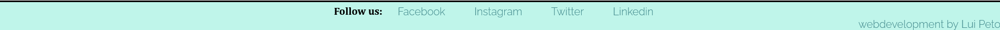
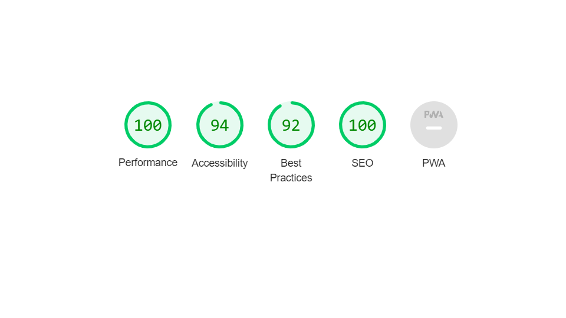
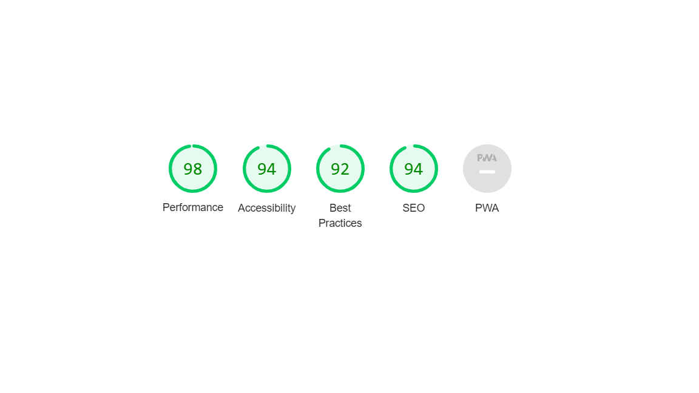

# Taoiseach Clinic
  

**Welcome to [Taoiseach Clinic](https://8000-luinen-123-hyc0nio3mvx.ws-eu64.gitpod.io/)!**
  

This Readme provides an overview of what is the essence of the site. Taoiseach Clinic is a private hospital site where sick people can look for reliable treatment and excellent staff members in any case. It offers a wide variety of services and is available to anyone. Booking is simple and fast. 


  

## Features

I explain the website features below.

### **Existing features**
  

- **Navigation bar**
  - This section will allow the user to easily navigate from page to page across all devices without having any issues. The full responsive navigation bar includes links to the Home page, Pricelist and Contact us page and is identical in each page to allow for easy navigation. 
  - The active page appears with orange, which highlights it from the background. 



- **The landing Page**
  - The landing page shows reliability and calmness for the users. 


- **Book and make an appoinment section**
  - This section grabs the users' attention. If they are not familiar with the site, then they can easily and quickly make an appointment. If the users click on it, it will redirect them to the contact page.
  


  - The form is easy to use. The placeholders show a good example of what their customer should write in the form, and the active page appears with an orange border, which highlights it.



- **Service section**
  - In this part, the users get knowledge about the hospital services and what they should expect. 



- **Pricelist**
  - In this section the users view 2 tables with the current prices.



- **The Footer**
  - The footer section includes links to the relevant social media sites for *Taoiseach Clinic*. The links will open to a new tab to allow easy navigation for the user.
  - It is similar to the navigation bar. The active page appears orange with beige background.  



### **Features left to implement**
- I want to add a gallery with hardworking staff members and satisfied patients 
- I will add a survey, where the users can rate the Clinic
- a welcome message on the landing image
- I plan to add euro icons in the pricelist section
  


## Testing

I tested my codes continuously with the W3C validator and CSS Validator during my work. The biggest issue was the responsive design of the navigation system for mobile version. Halfway through the project, I decided to give a new navigation bar, because the first version caused too many bugs. The navigation bar works and is more responsive than the previous version, the book appointment link redirects to the contact page, the tables on the pricelist page work as intended, the footer links open in a new tab, The section form is working, and the users get a thank you message by clicking on the send button. If I were a user, who wanted to know more about this private hospital, then this site would give me every information. It is easy to spot the "book an appointment" div on the index page, and the users can learn more about the hospital services. The form helps the users to fill it out correctly and if they still have any concerns/questions, they can use the textarea. 

#### **Lighthouse testing**

I used lighthouse to check the performance of my home page for mobile devices and desktop.
- I designed the site for the desktop version first, and I was happy to see everything was green on the first try.

- Similar high green numbers on the mobile version, but slightly worse than on the desktop version. The pictures aspect ratio caused this difference. 
 

#### **Validator Testing**

- **HTML**
  - Index page validation
    - I did not delete some closing tag elements, for example, the list closing tag below. These were easy to fix and did not cause any significant issues.

    ```
    <h2> Taoiseach Clinic is the best private hospital in the capital.</h2></li>
        <p>If you are familiar with our site, please book an appointment here or the <span>Contact Us</span> menu point:
    ```

    - I put the id in the span, and the content's left margin was clickable when I centred it. After I put in the parent element(div), it solved the problem.  

  ```
  <div>
      <a href="contact.html">
          <span id="book">Book an appointment</span></a>
  </div>
  ```

  - Pricelist page valiadation
    - no errors were returned when passing through the w3c validator

  - Contact page validation
    - I forgot to close the anchor element, so any time I clicked on the form (name, email or textarea), a link opened in a new tab. After I closed it, it did not cause more problems.

```
<div>
<a href="">
</div>
```
- After these mistakes were fixed, no errors were returned when passing through the official [W3c validator](https://validator.w3.org/)

- **CSS**
  - The page had an 8px default margin. First I tried to set the margins -8px to solve it, but later I realized that the solution is much easier and I wrote this:
  ```
  * {
    margin: 0;
    padding: 0;
  }
  ```
  - First time running the css validator I got 1 error and 1 warning message: 
    - 85 Value Error : font-weight 700px is not a font-weight value : 700px
    - 1 Imported style sheets are not checked in direct input and file upload modes 
  ``` 
  h4 {
    color: #4b9193;
    letter-spacing: 3px;
    font-weight: 700px;
  }
  ```
    - After I deleted the px, it solved the problem.
  - After these mistakes were fixed, no errors were returned when passing through the official [Jigsaw](https://jigsaw.w3.org/css-validator/)

## Deployment  
- The site was deployed to GitHub pages. The steps to deploy are as follows: 
  1. In the GitHub repository, navigate to the Settings tab
  2. From the source section drop-down menu, select the Master Branch
  3. Once the master branch has been selected, the page will be automatically refreshed with a detailed ribbon display to indicate the successful deployment.
  4. The live link can be found here: 


## Credits

#### Content

- The data for the services section was taken from [Easymed](https://www.easymed.health/general-consultation) and [Health Images](https://www.healthimages.com/what-is-diagnostic-imaging/).
- Instructions on how to use flexbox on the our services section was taken from [LearnWeCode](https://www.youtube.com/user/LearnWebCode)
- I learned most of the instructions and tutorials from the[CodeInstitute] site(https://codeinstitute.net/ie/).

#### Media 

- The images use for the header and services were taken from [Istockphoto](https://www.istockphoto.com/photos-free?utm_medium=cpc&utm_source=GOOGLE&utm_campaign=IE_Tail_EN_DSA&utm_content=Free_DSA&utm_term=DYNAMIC+SEARCH+ADS&ds_rl=1261606&ds_rl=1265190&ds_rl=1265190&gclid=Cj0KCQjw7KqZBhCBARIsAI-fTKIp5InQ3oDn-zLVzejPNf0r3iu8VILmYPpd-davF8CMQq8AxYaF6NEaAhJYEALw_wcB&gclsrc=aw.ds) and I used some AI generated pictures from [MidJourney](https://www.midjourney.com/home/). 

